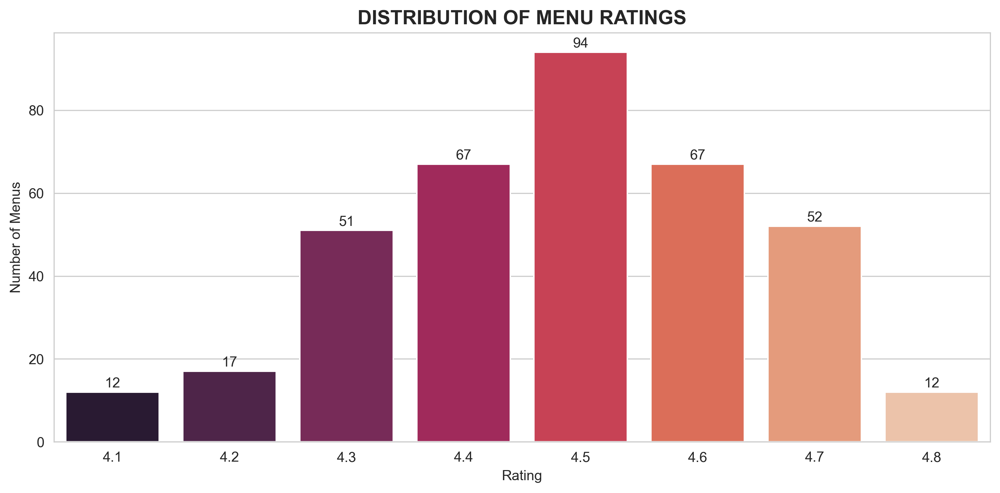

# 🍽️ Malang Food Analysis - Data Analysis Portfolio Project


## 📊 Project Overview
End-to-end data analysis project analyzing 372 menu items from 89 restaurants in Malang, Indonesia. Data was manually collected from Google Maps and analyzed using Excel, MySQL, and Python.

## 🎯 Project Objectives
1. Identify the most popular food menus in Malang
2. Analyze restaurant popularity based on reviews
3. Understand price segmentation and rating distribution
4. Demonstrate complete data analysis workflow from collection to visualization

## 📁 Project Structure
```
malang-food-analysis/
├── data/                          # Raw and processed data
│   ├── raw/                       # Original Excel data
│   └── processed/                 # Cleaned CSV data
├── scripts/                       # Analysis scripts
│   ├── excel_cleaning/            # Excel processing documentation
│   ├── sql_analysis/              # MySQL database & queries
│   └── python_visualization/      # Python analysis & visualization
├── outputs/                       # Generated visualizations
├── insights/                      # Key findings & recommendations
├── README.md                      # This documentation
└── requirements.txt               # Python dependencies
```

## 🛠️ Tools & Technologies Used
| Tool | Version | Purpose | My Skill Level |
|------|---------|---------|----------------|
| **Microsoft Excel** | Office LTSC 2024 | Data cleaning, initial analysis | Intermediate |
| **MySQL** | Workbench 8.0 CE | Database management, SQL queries | Beginner |
| **Python** | 3.13.7 | Advanced analysis & visualization | Beginner |
| **pandas** | 2.3.3 | Data manipulation in Python | Beginner |
| **matplotlib** | 3.10.8 | Basic data visualization | Beginner |
| **seaborn** | 0.13.2 | Enhanced visualization styling | Beginner |

## 📈 Analysis Process

### Phase 1: Excel Data Processing
- Manual data collection from Google Maps (372 data points)
- Price standardization and conversion to Rupiah
- Menu categorization (Protein, Karbo, Pendamping)
- Initial analysis with pivot tables and charts

### Phase 2: MySQL Database Analysis
- Database schema design and creation
- CSV data import to MySQL
- 5 basic SQL queries for insights
- Query results documentation

### Phase 3: Python Visualization
- Data loading and basic exploration
- 5 key visualizations using matplotlib and seaborn
- Generation of business insights
- Chart export for reporting

## 📊 Key Insights

### 1. 🥇 Most Discussed Menus
Sambal is the most frequently mentioned menu item in reviews, indicating the importance of condiments in Indonesian cuisine.

### 2. 🏆 Most Popular Restaurants
Ocean Garden restaurants dominate in total reviews, showing strong brand presence in Malang.

### 3. 📊 Menu Category Distribution
- **Pendamping**: 38.6% (side dishes, sambal, vegetables)
- **Protein**: 31.6% (chicken, fish, meat)
- **Karbo**: 29.8% (rice, noodles, porridge)

### 4. 💰 Price Segmentation
Majority of menus fall in the affordable price range (< Rp 25,000), making Malang's food scene accessible.

### 5. ⭐ Quality Consistency
Most restaurants maintain high ratings (4.0+), indicating consistent quality across establishments.

## 📸 Visualizations

### Excel Analysis

<p align="justify">
  <em>Initial analysis in Excel shows the distribution of menu categories</em>
</p>

### Python Visualizations

#### Top 5 Most Mentioned Menu

*Top 5 most discussed menu items*

#### Top 5 Most Popular Restaurants

*Top 5 Restaurant by total reviews*

#### Menu Distribution Categories

*Menu distribution across categories*

#### Price Segmentation

*Price range distribution of menus*

#### Rating Distribution

*Rating distribution across all menus*

## 🚀 How to Reproduce This Analysis

### Prerequisites
```bash
# Install Python dependencies
pip install -r requirements.txt

# MySQL database setup
mysql -u root -p < scripts/sql_analysis/database_schema.sql
```

### Run Python Analysis
```bash
cd scripts/python_visualization
python simple_analysis.py
```

### Run SQL Queries
```sql
-- Access MySQL and run queries
USE malang_food_analysis;
SOURCE scripts/sql_analysis/simple_queries.sql;
```

## 📝 Learning Journey

### Honest Skill Assessment
This project represents my current abilities as a beginner in data analysis:
- **Excel (Intermediate)**: Comfortable with data cleaning, formulas, and pivot tables
- **SQL (Beginner)**: Basic queries (SELECT, COUNT, GROUP BY, ORDER BY, LIMIT)
- **Python (Beginner)**: Basic pandas operations and matplotlib/seaborn visualizations

### Learning Philosophy
I believe in starting with fundamentals and being honest about current abilities. This project demonstrates what I can do today, with clear documentation of my learning process.

## Methodology Documentation
Complete documentation of my learning process is available:
- [Excel Processing Steps](scripts/excel_cleaning/data_cleaning_steps.md)
- [SQL Learning Notes](scripts/sql_analysis/sql_learning_notes.md)
- [Python Learning Notes](scripts/python_visualization/python_learning_notes.md)

## 🤝 Contributing
This is a personal portfolio project. Feedback and suggestions are welcome!

## 📄 License
This project is licensed under the MIT License - see the LICENSE file for details.

## 👨‍💻 Author
**Fahrul Fauji**  
- Fresh Graduate IT | Published Researcher (SINTA 4)  
- [GitHub](https://github.com/fahrulfauji)  
- [LinkedIn](https://www.linkedin.com/in/fahrul-fauji-6729b8383/)  
- Research Publication: [Journal of Information System Research (JOSH) ](https://doi.org/10.47065/josh.v6i3.6959)

---
*Project completed: January 2026*  
*Tools: Python 3.13.7 | Excel LTSC 2024 | MySQL Workbench 8.0 CE*  
*"Start simple, be honest, keep learning"*

---

## 🔗 Quick Links
- [View Full Code on GitHub](https://github.com/fahrulfauji/malang-food-analysis)
- [Download Project Files](#)
- [Contact Author](#)

**⭐ If you find this project helpful, please give it a star on GitHub!**

---
