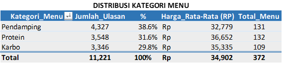
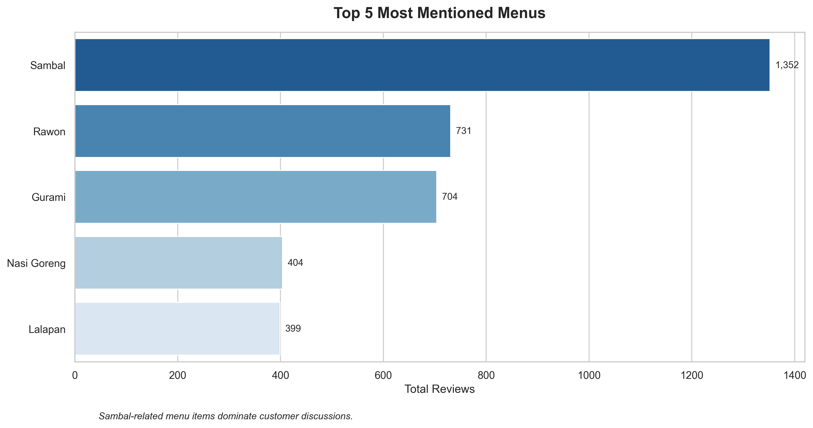
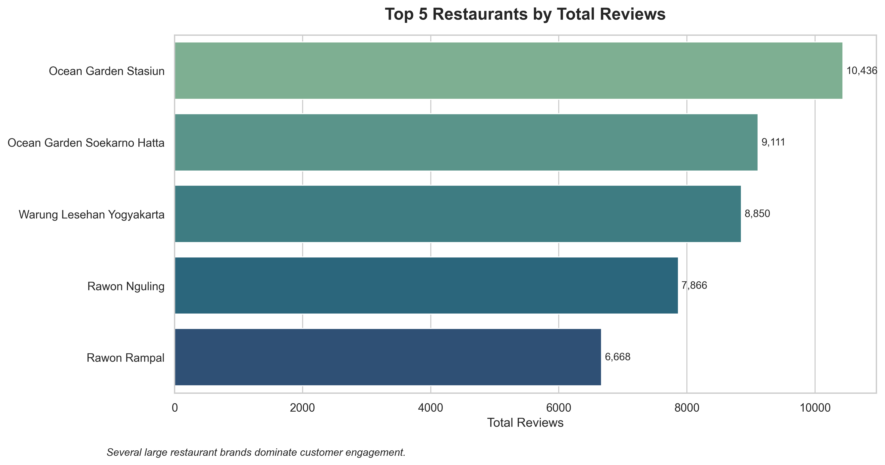
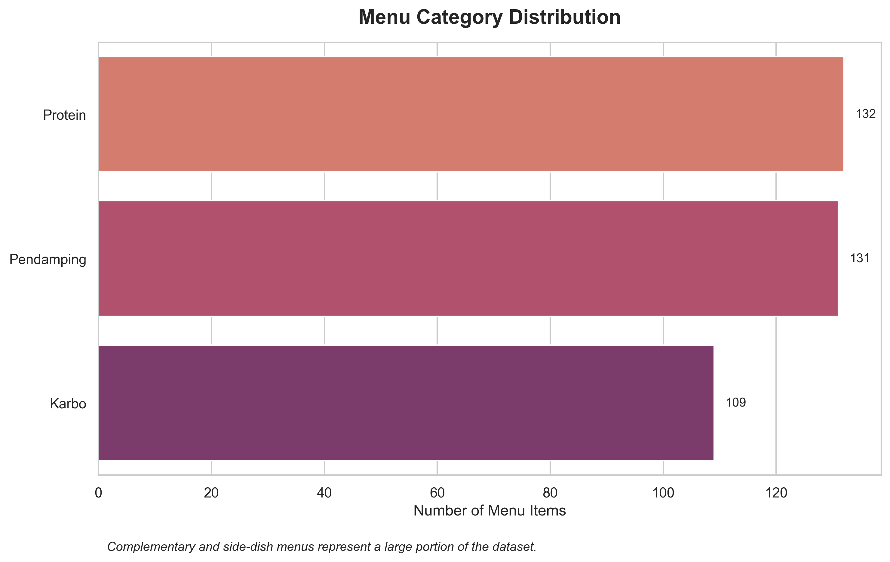
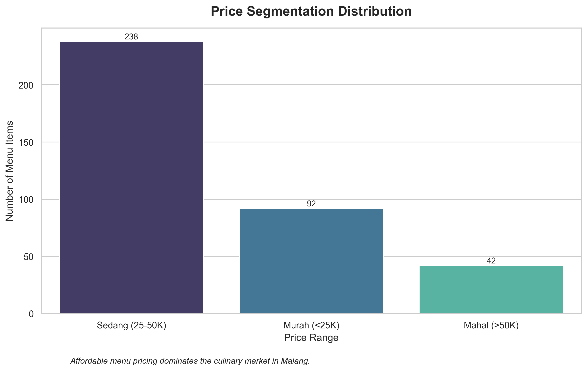
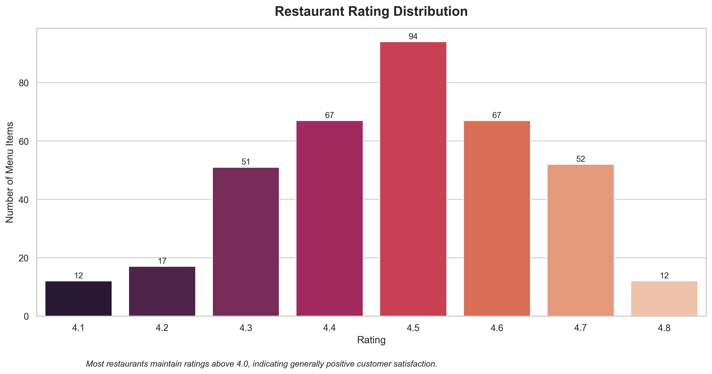

# 🍽️ Malang Food Analysis — Exploratory Data Analysis Portfolio Project


---

## 📊 Project Overview

This project explores culinary trends and restaurant characteristics in Malang City, Indonesia, using data collected manually from publicly available Google Maps information.

The analysis focuses on:
- menu category distribution,
- restaurant review activity,
- pricing patterns,
- and rating distribution.

This portfolio project also demonstrates an end-to-end exploratory data analysis workflow using:
- Microsoft Excel,
- MySQL,
- and Python.

The workflow covers:
- manual data collection,
- data cleaning,
- exploratory analysis,
- visualization,
- and basic business-oriented insight generation.

---

## 🎯 Project Objectives

1. Analyze menu category distribution within Malang’s culinary market
2. Identify restaurants with high review activity
3. Explore pricing patterns across menu categories
4. Analyze restaurant rating distribution
5. Practice an end-to-end exploratory data analysis workflow
6. Translate raw culinary data into structured insights

---

## 📁 Project Structure

```text
malang-food-analysis/
├── data/
│   ├── raw/                       # Original datasets
│   └── processed/                 # Cleaned CSV datasets
│
├── scripts/
│   ├── excel_cleaning/            # Excel preprocessing workflow
│   ├── sql_analysis/              # SQL schema and exploratory queries
│   └── python_visualization/      # Python analysis and visualization
│
├── outputs/                       # Exported charts and visualizations
├── insights/                      # Findings and business recommendations
├── README.md                      # Main project documentation
└── requirements.txt               # Python dependencies
````

---

## 🛠️ Tools & Technologies

| Tool            | Purpose                         |
| --------------- | ------------------------------- |
| Microsoft Excel | Data cleaning and preprocessing |
| MySQL           | Exploratory SQL analysis        |
| Python          | Data analysis and visualization |
| pandas          | Data manipulation               |
| matplotlib      | Visualization                   |
| seaborn         | Visualization styling           |

---

## 📈 Analysis Workflow

### 1. Excel Data Cleaning & Preparation

The Excel stage included:

* manual data recording,
* price standardization,
* menu categorization,
* and initial exploratory analysis using pivot tables.

Menu categories were grouped into:

* Protein
* Karbo
* Pendamping

---

### 2. SQL Exploratory Analysis

MySQL was used to:

* create database schema,
* import cleaned CSV data,
* perform aggregation queries,
* analyze category distribution,
* and identify highly reviewed restaurants and menu items.

---

### 3. Python Visualization & Insight Generation

Python analysis included:

* dataset exploration using pandas,
* visualization using matplotlib and seaborn,
* distribution analysis,
* and generation of exploratory insights from visual patterns.

Generated charts were exported into the `outputs/` folder for reporting and presentation purposes.

---

## 📊 Key Insights

### 🥇 Complementary Menu Items Appear Frequently in Reviews

Sambal-related menu items appear frequently within customer reviews, suggesting that complementary side dishes play an important role in dining preferences.

---

### 🏆 Several Restaurant Brands Dominate Review Volume

Ocean Garden restaurants appear consistently within top review rankings, indicating strong visibility within the sampled dataset.

---

### 📊 Relatively Balanced Menu Category Distribution

* **Pendamping:** 38.6%
* **Protein:** 31.6%
* **Karbo:** 29.8%

The dataset shows relatively balanced menu composition across categories.

---

### 💰 Affordable Pricing Dominates the Dataset

Most menu items fall below Rp25,000–Rp50,000, indicating that affordable and mid-range pricing dominates the culinary market within the dataset.

---

### ⭐ Most Restaurants Maintain Ratings Above 4.0

The majority of restaurants maintain ratings above 4.0, suggesting generally positive customer satisfaction across sampled restaurants.

---

## 📸 Visualizations

### Excel Pivot Table Analysis



<p align="justify">
<em>
Initial exploratory analysis using Microsoft Excel pivot tables to summarize menu categories and review patterns.
</em>
</p>

---

## Python Visualizations

### Top 5 Most Mentioned Menus



*Visualization of menu items with the highest review mentions.*

---

### Top 5 Restaurants by Total Reviews



*Comparison of restaurants based on total review volume.*

---

### Menu Category Distribution



*Distribution of menu categories within the dataset.*

---

### Price Segmentation Distribution



*Distribution of menu price segments across the dataset.*

---

### Rating Distribution



*Distribution of restaurant ratings from the collected data.*

---

## 🚀 How to Reproduce This Analysis

### Install Python Dependencies

```bash
pip install -r requirements.txt
```

---

### Setup MySQL Database

```bash
mysql -u root -p < scripts/sql_analysis/database_schema.sql
```

---

### Run Python Analysis

```bash
cd scripts/python_visualization
python basic-analysis.py
```

---

### Run SQL Queries

```sql
USE malang_food_analysis;
SOURCE scripts/sql_analysis/simple_queries.sql;
```

---

## 📝 Learning Journey

This project represents my current learning journey in exploratory data analysis using Excel, SQL, and Python.

Through this project, I practiced:

* data cleaning and preprocessing,
* SQL aggregation and filtering,
* exploratory data analysis,
* data visualization,
* and translating raw data into structured insights.

### Learning Philosophy

I believe in:

* building strong fundamentals,
* documenting the learning process transparently,
* and improving analytical thinking through hands-on projects.

---

## 📚 Documentation

Additional project documentation:

* [Excel Data Cleaning Workflow](scripts/excel_cleaning/data_cleaning_steps.md)
* [SQL Learning Notes](scripts/sql_analysis/sql_learning_notes.md)
* [Python Learning Journey](scripts/python_visualization/python_learning_journey.md)

---

## ⚠️ Project Limitations

* The dataset represents a single-time snapshot
* Data was collected manually from publicly available Google Maps information
* Analysis is descriptive and exploratory only
* Advanced statistical analysis and machine learning were not included in this project

---

## 📄 License

This project is licensed under the MIT License.

---

## 👨‍💻 Author

**Fahrul Fauji**

* Fresh Graduate in Information Technology
* Published Researcher in Data Clustering and Information Systems

### Research Publication

* [Journal of Information System Research (JOSH)](https://doi.org/10.47065/josh.v6i3.6959)

### Connect With Me

* [GitHub](https://github.com/fahrulfauji)
* [LinkedIn](https://www.linkedin.com/in/fahrul-fauji-6729b8383/)

---

## 📌 Project Information

* Project Completion: January 2026
* Dataset Type: Culinary Market Data
* Tools Used: Excel, MySQL, Python

> *"Start simple, be honest, keep learning."*

---

⭐ If you find this project interesting, feel free to give it a star on GitHub.